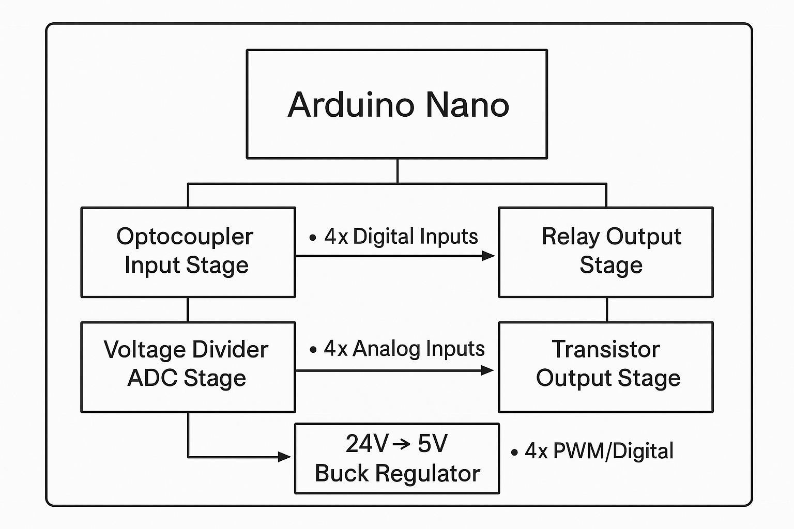

⸻

<h1>⚡ Arduino-Based Mini PLC Controller</h1>

A compact, open-source PLC built on an Arduino Nano — programmable with Ladder Logic using OpenPLC and Outsell.

🧭 Overview

This project is a custom-designed mini industrial PLC built around the Arduino Nano microcontroller, offering the feel of a real industrial controller in a compact, low-cost, open-source form.
It features optocoupler-protected inputs, relay + transistor outputs, direct 24V compatibility, and support for ladder logic programming through OpenPLC and the Outsell Platform — meaning no Arduino coding required.

The goal is to bridge the gap between maker electronics and professional automation.

⸻

🚀 Key Features

🔋 Power
	•	Direct 24V DC input
	•	Onboard buck converter (24V → 5V)
	•	Noise-filtered & protected power rails

🌐 Inputs
	•	4 Digital Inputs (opto-isolated)
	•	4 Analog Inputs with built-in voltage divider

⚡ Outputs
	•	4 Relay Outputs (AC/DC load control)
	•	4 Transistor Outputs
	•	Digital or PWM-based analog-style control

💡 Programming
	•	Compatible with:
✔ OpenPLC
✔ Outsell Platform
	•	Program using ladder logic, not Arduino code

⸻

🔧 Hardware Architecture

⸻

🧩 Programming With OpenPLC

1. Install OpenPLC

Download from: https://www.openplcproject.com

2. Configure Arduino Nano
	•	Select Arduino as hardware
	•	Choose Nano (ATmega328P) runtime

3. Build Ladder Logic
	•	Ladder Diagram or Function Block Diagram
	•	Add contacts, coils, timers, counters
	•	Compile → Upload to the board

4. Operate Like a Real PLC
	•	Monitor input/output states
	•	Control relays and transistor outputs

⸻

🟧 Programming With Outsell

Using the Outsell Ladder Platform
	1.	Open the Outsell Ladder Editor
	2.	Select Arduino / AVR Target
	3.	Create logic using drag-and-drop blocks
	4.	Download firmware
	5.	Flash using Arduino bootloader

Perfect for education and rapid prototyping.

⸻

🛠️ Getting Started

Hardware Setup
	1.	Connect a 24V DC power supply
	2.	Wire sensors to the digital/analog inputs
	3.	Wire loads to relay/transistor outputs
	4.	Connect USB cable to your PC

Uploading Firmware

Use OpenPLC, Outsell, or Arduino IDE.

⸻

🧪 Testing
	•	LED indicators show input/output activity
	•	Relays click when switching
	•	Optional Serial Monitor for diagnostics

⸻

📸 Images

⸻

🛠️ Future Improvements
	•	RS485 / Modbus
	•	Ethernet or WiFi
	•	HMI display module
	•	DIN-rail enclosure
	•	Expandable I/O modules

⸻

📘 License

Open-source hardware project.
Modify and improve freely.

⸻

